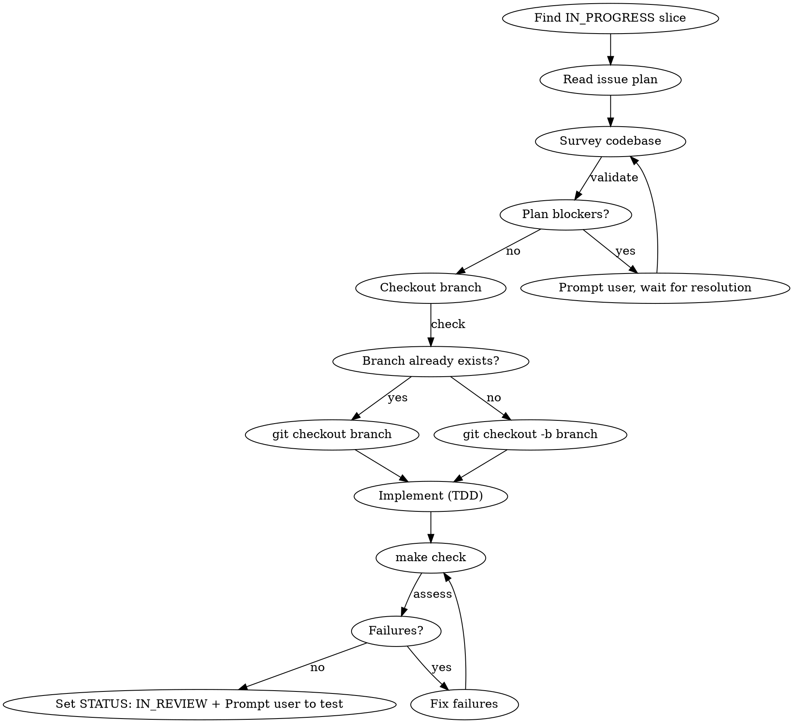

# Build — Slice Implementation

## Overview

Pick up the IN_PROGRESS slice, validate the plan against the current codebase, switch to
the feature branch, implement with TDD, and hand off to the user for manual testing.

**Announce at start:** "Using the build skill to implement the current IN_PROGRESS slice."

## Workflow



## Steps

### 1. Find the IN_PROGRESS slice

Read `docs/roadmap.md`. Find the **single** section with `STATUS: IN_PROGRESS`.
Note the slice number, name, branch name, and any **IMPORTANT** constraint blocks.

If no slice is `IN_PROGRESS`, stop and tell the user to run `/refine` first.

### 2. Read the issue plan

Open `docs/issues/NNN-kebab-case-name.md` (matching the IN_PROGRESS slice).
Read the **entire** file — context, scope, file-by-file plan, implementation order, and verification commands.

### 3. Survey the codebase

Read every file the plan mentions as "modify". Read the existing test files to understand
established patterns. Read public interfaces the slice must satisfy.

Goal: confirm the plan's type signatures, import paths, and function names are still
accurate given the current code.

### 4. Validate the plan

Before touching any code, check for:

- **Blockers** — plan references a type, function, or interface that doesn't exist yet
- **Divergence** — current code has drifted from the plan's assumptions (renamed fields, changed signatures, etc.)
- **Ambiguity** — a step in the implementation order is too vague to execute safely

If any issue is found, describe it clearly and ask the user how to resolve it.
**Do not begin implementation until the plan is fully understood and sound.**

If the plan has a genuine gap that requires consulting product intent, read the relevant
section of `docs/PRD.md` on demand — do not read the whole document speculatively.

### 5. Checkout the feature branch

The branch name is in the issue frontmatter: `branch: feat/NNN-kebab-case-name`.

```bash
# Check current branch — must NOT be main
git branch --show-current

# Switch (create if it doesn't exist yet)
git checkout feat/NNN-kebab-case-name 2>/dev/null || git checkout -b feat/NNN-kebab-case-name
```

**Never implement on `main`.** If already on the correct feature branch, proceed.

### 6. Implement with TDD

Follow the plan's **Implementation order** section exactly — step by step, in the numbered
sequence. Do not reorder steps.

**Red-green cycle per step:**

1. Write the test(s) for the step.
2. Run `go test ./...` — confirm they fail (red).
3. Write the minimum implementation to make them pass.
4. Run `go test ./...` — confirm they pass (green).

**Commit at each logical checkpoint** (typically after each numbered step passes):

```bash
git add <specific files>
git commit -m "feat(slice-NNN): <short description of step>"
```

Keep commits atomic — one logical change per commit.

**Architecture non-negotiables** (from CLAUDE.md):
- `ctx context.Context` is the first parameter of every I/O function
- UI layer depends on `store.Store` interface, never on `*sql.DB`
- All side effects returned as `tea.Cmd`; no goroutines inside handlers
- `url.Values` for all query strings — no string interpolation
- Error wrapping: `fmt.Errorf("outer: %w", err)`
- Tests: real SQLite via `t.TempDir()`; `httptest.NewServer` for API fakes

### 7. Final quality check

> **CRITICAL — this step is mandatory and non-negotiable:**
>
> You MUST run all checks and they MUST all be green before this step is complete.
> Do NOT proceed to step 8 until every check passes. Do NOT report success while
> any check is failing. There are no exceptions.

Once all steps are implemented:

```bash
make check   # fmt + lint + test + vuln — ALL must pass
make build   # binary must compile cleanly
```

**If anything fails:**
1. Read the failure output carefully.
2. Fix the root cause — do not suppress warnings, skip linters, or use `//nolint` to paper over issues.
3. Re-run `make check` from scratch.
4. Repeat until every check is green.

**Red flags — if you are thinking any of these, stop:**
- "The lint warning is minor, I'll proceed anyway"
- "Tests pass locally, the lint failure is just style"
- "I'll note the failure and move on"
- "This check is flaky, I'll skip it"

The only valid exit from step 7 is `make check` and `make build` both exiting with status 0, no failures, no skipped checks.

### 8. Update roadmap and issue

> **CRITICAL — read before touching any status field:**
>
> Set status to **`IN_REVIEW`** / **`in_review`**. Never `DONE` / `done`.
>
> `DONE` is set exclusively by the user or the `/qa` skill after manual verification.
> If you write `DONE` here you have violated the workflow. There is no exception.

1. In `docs/roadmap.md`, change the slice's `STATUS: IN_PROGRESS` → `STATUS: IN_REVIEW`.
2. In the issue file frontmatter, change `status: in_progress` → `status: in_review`.

**Red flags — if you are about to write any of these, stop:**
- `STATUS: DONE`
- `status: done`
- "marking as complete"
- "marking as done"

The correct and only values after `/build` are `IN_REVIEW` (roadmap) and `in_review` (issue frontmatter).

### 9. Prompt the user to test

Present a brief handoff message:

```
Implementation complete. Here's what was built:

<2–4 bullet summary of what was implemented>

To test manually:
<copy the Verification commands from the issue file>

All checks pass (make check + make build). Ready for your review.
```

Do NOT create a PR or merge. Hand off to the user for manual verification.
