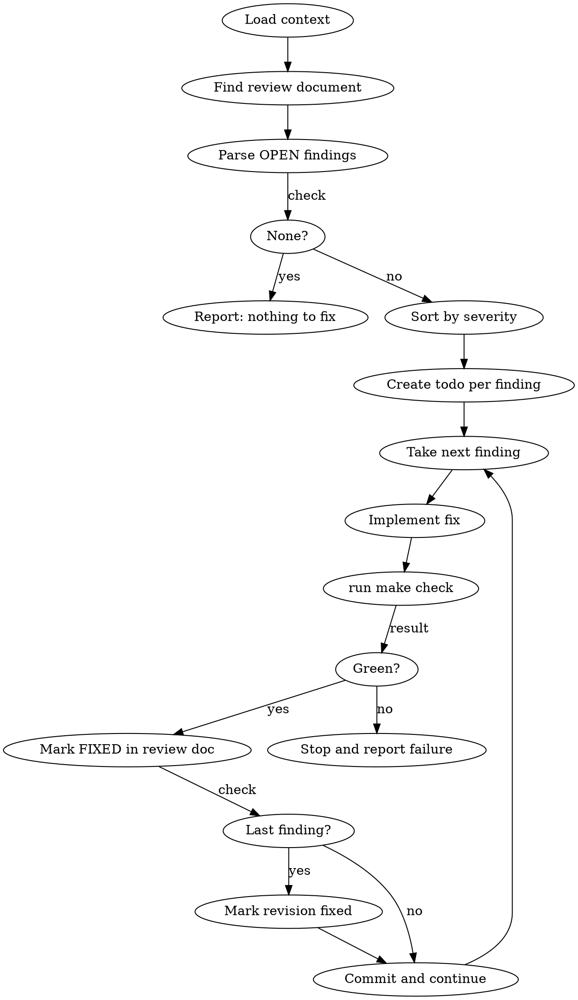

# Fix — Resolve QA Findings

## Overview

Work through all OPEN findings in the current review document, highest severity first.
Each finding is fixed, verified with `make check`, then committed alongside the updated
review document. The revision is closed when all findings are FIXED.

**Announce at start:** "Using the fix skill to resolve open findings."

## Workflow



## Steps

### 1. Load context

Read `docs/roadmap.md` to find the slice with `STATUS: IN_REVIEW`. Note the slice number
and name.

Find the active revision file:
- List all files matching `docs/reviews/NNN-kebab-case-name/revision-*.md`
- Read the frontmatter of each (they are small — this is cheap)
- Find the file with `status: in_progress` — that is the revision to fix

**Stop conditions:**
- No slice is IN_REVIEW → tell the user to run `/build` first
- Review directory does not exist → tell the user to run `/qa` first
- No revision file has `status: in_progress` → report "No active revision to fix. Run /qa
  to create a new revision."

Read the `in_progress` revision file in full.

### 2. Parse OPEN findings

Scan every table in the document for rows where the `Status` column is `OPEN`.
Ignore rows with `FIXED` or `DISCARDED`.

For each OPEN finding collect:
- **ID** (e.g. `F1`, `I2`)
- **Severity** (`BLOCKER`, `HIGH`, `MED`, `LOW`)
- **Summary** (the table row's one-line description)
- **Detail** (the `**ID** path:line` paragraph below the table)

If no OPEN findings exist, report "Nothing to fix — all findings are already FIXED or
DISCARDED." and stop.

### 3. Sort and plan

Order by severity: `BLOCKER` → `HIGH` → `MED` → `LOW`.  
Within the same severity, preserve document order.

Create a TodoWrite todo for each finding in sorted order.

### 4. Fix each finding

Repeat for each finding in order:

#### a. Understand the change

Read the detail paragraph and every file it references. Understand the exact change
required before touching any code.

#### b. Implement the fix

Make the minimal change that resolves the finding. Do **not**:
- Refactor surrounding code
- Fix other unrelated issues (even obvious ones — log them separately)
- Add features or cleanups beyond the finding's scope

#### c. Run `make check`

```bash
make check
```

**If `make check` fails:** Stop immediately. Do not mark the finding FIXED. Report:

```
Fix for [ID] failed make check. Stopping.

<paste the relevant error output>

Fix the issue manually, then run /fix again to continue.
```

Do not attempt the remaining findings.

#### d. Mark the finding FIXED in the review document

Update the finding's table row — change `OPEN` to `FIXED`:

```
| I2 | MED | OPEN  | Duplicate testCtx vars in test package |
```
→
```
| I2 | MED | FIXED | Duplicate testCtx vars in test package |
```

Do not change any other part of the document.

#### e. If this is the last OPEN finding, update the revision status

Update `status` in the revision file's frontmatter:
```yaml
status: done
```

#### f. Commit

Stage only the modified source files and the revision file. Use this commit message
format:

```
fix(slice-NNN): resolve [ID] — <one-line summary from finding>

Closes finding [ID] in docs/reviews/NNN-kebab-case-name/revision-R.md
```

Mark the todo for this finding complete.

### 5. Report to user

```
Fix complete for slice NNN (revision R).

Fixed N findings:
• [F1] HIGH  — <summary>
• [I2] MED   — <summary>

make check passes. Review status: fixed.
Next step: run /qa again — a clean pass will close the slice.
```

If any finding was skipped because `make check` failed, say so clearly and do not claim
the review is fixed.
