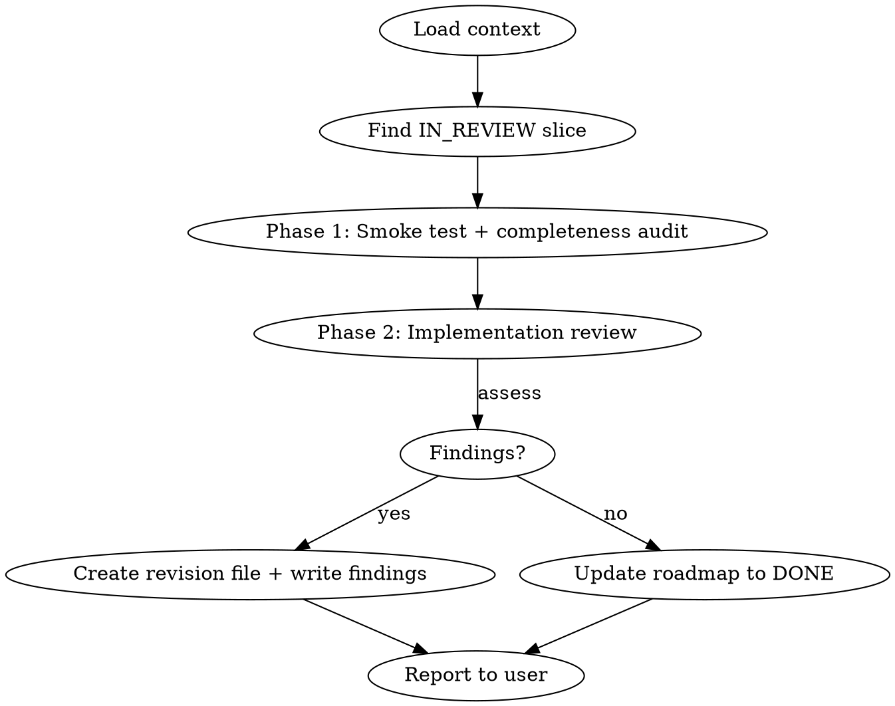

# QA — Slice Review

## Overview

Review the IN_REVIEW slice in two phases: (1) smoke test + completeness audit — confirm
the build passes and every scope item is implemented and tested; (2) implementation review
— audit the diff for bugs, anti-patterns, and architecture deviations. Produce a
structured review document and report findings to the user.

**Announce at start:** "Using the qa skill to review the current IN_REVIEW slice."

## Workflow



## Steps

### 1. Load context

Read these files before doing anything else:
- `docs/PRD.md` — feature specs, UI layout, keyboard map, data model
- `docs/ARCHITECTURE.md` — conventions every file must follow
- `docs/roadmap.md` — find the single slice with `STATUS: IN_REVIEW`

If no slice is `IN_REVIEW`, stop and tell the user to run `/build` first.

### 2. Find the IN_REVIEW slice

Note the slice number, name, branch name. Open `docs/issues/NNN-kebab-case-name.md` and
read the entire file — scope, file plan, implementation order, and verification commands.

### 3. Phase 1 — Smoke test + completeness audit

**Goal:** Verify the slice scope is fully implemented and that tests actually cover the
specified behaviour. Look for gaps only — do not report style or code quality here.

#### TUI limitation

The app runs in raw terminal mode with alt-screen. The agent cannot interact with it
(no TTY, no keyboard). Feature verification relies on three things:

1. **Tests pass** — since this project uses TDD, passing tests ARE the behavioral spec.
   `TestCursorMovesDownOnJ` passing means `j` navigation works. Run:
   ```bash
   make check          # fmt + lint + test + vuln — must all pass
   make build          # binary must compile cleanly
   ```

2. **Launch smoke test** — confirms no panic on startup:
   ```bash
   timeout 3 go run ./cmd/crypto-tracker 2>&1 || true
   ```
   A non-zero exit from the timeout signal is expected and fine. A Go panic or
   `runtime error` in the output is a `BLOCKER` finding.

3. **Code reading** — read the implementation against:
   - The **Scope** section of the issue file (every bullet is a deliverable)
   - The relevant **PRD** sections (keyboard map, UI layout, data model)
   - The **Verification** section of the issue — every listed command is a checkpoint

#### What to look for

- A scope bullet with no corresponding code path → gap finding
- A verification command the code provably cannot satisfy → gap finding
- A test that exists but whose assertion is trivially true (always passes) → finding
- A scope item with no test coverage at all → finding (unless it is purely visual)

If the feature is complete and correct, write:

```markdown
## Smoke test + completeness audit

No findings. All scope items implemented, test coverage adequate, verification
commands satisfied.
```

---

### 4. Phase 2 — Implementation review

**Goal:** Find bugs, anti-patterns, architecture deviations, and bad practices in the diff.

#### What to read

```bash
git diff main...HEAD   # all changes on this branch
```

Then re-read every file the diff touches, plus its test file.

#### What to check against

- **Architecture non-negotiables** (from ARCHITECTURE.md / CLAUDE.md):
  - `ctx context.Context` is the first parameter of every I/O function
  - UI layer depends on `store.Store` interface, never on `*sql.DB`
  - All side effects returned as `tea.Cmd`; no goroutines inside handlers
  - `url.Values` for all query strings — no string interpolation
  - Error wrapping: `fmt.Errorf("outer: %w", err)`
  - Tests: real SQLite via `t.TempDir()`; `httptest.NewServer` for API fakes
  - Named `http.Client` with explicit timeout — never `http.DefaultClient`
  - WAL + FK pragmas set on every DB open

- **General code quality:**
  - Errors silently swallowed (missing `if err != nil`)
  - Nil pointer dereferences
  - Logic that diverges from the agreed plan without explanation
  - Duplicated code that belongs in a shared helper (e.g. `internal/format`)
  - Unexported types leaked across package boundaries
  - Test assertions that cannot actually fail (always-true conditions)

If the implementation is clean, write:

```markdown
## Implementation review

No findings. Implementation follows architecture conventions and issue plan.
```

---

### 5. Write findings (only if findings exist)

**If there are no findings from either phase:** skip this step entirely. Do not create
any file. Proceed to step 6.

**If there are findings:** create the revision file now.

**Determine the next revision number:**
- If `docs/reviews/NNN-kebab-case-name/` does not exist, create it. Next revision is 1.
- If it exists, count the `revision-*.md` files inside. Next revision is count + 1.

Create `docs/reviews/NNN-kebab-case-name/revision-N.md`:

```markdown
---
branch: feat/NNN-kebab-case-name
revision: N
status: in_progress
---

# Slice NNN — Name (Revision N)

## Smoke test + completeness audit

## Implementation review
```

Then write findings using the **table index + detail paragraph** format. Keep detail
paragraphs minimal — enough for the implementation agent to act without ambiguity.

**Severities:** `BLOCKER` · `HIGH` · `MED` · `LOW`  
**Statuses:** `OPEN` · `FIXED` · `DISCARDED`

```markdown
## Feature review

| ID | Sev | Status | Summary |
|----|-----|--------|---------|
| F1 | HIGH | OPEN | Cursor does not wrap on `G` when list is empty |

**F1** `internal/ui/app.go`  
Sending `G` with an empty coin list panics: `m.cursor = len(m.coins) - 1` evaluates to
`-1`. The issue plan requires cursor to stay at 0 when no coins are loaded.

## Implementation review

| ID | Sev | Status | Summary |
|----|-----|--------|---------|
| I1 | HIGH | OPEN | FetchMarkets silently swallows context error |
| I2 | MED | OPEN | `truncate` helper defined inline, belongs in format package |

**I1** `internal/api/coingecko.go:45`  
When context is cancelled mid-request, the error from `http.NewRequestWithContext` is
overwritten and `nil` is returned. Callers cannot detect cancellation.

**I2** `internal/ui/app.go:203`  
`truncate` is defined as a closure inside `View`. Per architecture conventions, shared
formatting helpers belong in `internal/format`.
```

### 6. Update roadmap and report

**If findings exist:** do not touch the roadmap. The revision file already has
`status: in_progress`. Hand off to the user to run `/fix`.

**If no findings:** update the roadmap:
- Change `STATUS: IN_REVIEW` → `STATUS: DONE`
- Change the issue frontmatter `status: in_review` → `status: done`

No revision file was created — the last `done` revision stands as the final audit record.

### 7. Report to user

```
QA review complete for slice NNN (revision N).

Smoke test + completeness audit: <PASSED / N findings>
Implementation review: <PASSED / N findings>

<If findings exist:>
Open findings (N total):
• [F1] HIGH — <one-line summary>
• [I1] HIGH — <one-line summary>

See docs/reviews/NNN-kebab-case-name/revision-N.md for detail.
Next step: run /fix to resolve findings, then run /qa again.

<If no findings:>
All checks passed. Roadmap updated to DONE. Ready to open a PR.
```

Do NOT open a PR or commit. Hand off to the user.
