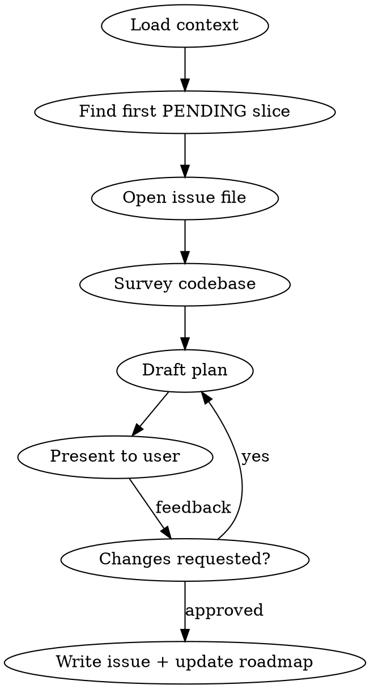

# Refine — Slice Planning

## Overview

Identify the next pending slice, survey the codebase, draft a detailed implementation plan, get user approval, then write the plan to the issue file and advance the roadmap status.

## Workflow



## Steps

### 1. Load context

Read these files before doing anything else:
- `docs/PRD.md` — feature specs, UI layout, keyboard map, data model
- `docs/ARCHITECTURE.md` — conventions that EVERY file must follow

### 2. Find the next slice

Read `docs/roadmap.md`. Find the **first** section where `STATUS: PENDING`. Note the slice number, name, and scope bullets. Also note any **IMPORTANT** blocks under that section — they carry constraints that must be reflected in the plan.

### 3. Open the issue file

Issue files live in `docs/issues/` as `NNN-kebab-case-name.md`. The file already exists with a `status: pending` stub — you will fill it in.

### 4. Survey the codebase

Read existing source and test files to understand the current state. Prioritise:
- Files the new slice will extend or depend on
- Established test patterns (`*_test.go` files)
- Public interfaces the slice must satisfy

### 5. Draft the plan

Produce a detailed plan that covers:

| Section | What to include |
|---------|-----------------|
| **Context** | What has been built; how this slice connects |
| **Scope** | Exact deliverables from roadmap bullets + PRD |
| **Data model** | SQL schema changes, if any |
| **Files to create/modify** | One subsection per file: purpose, key signatures, SQL patterns |
| **Tests** | One subsection per test file: each test by name + what it verifies |
| **Implementation order** | Numbered, TDD-first (tests red before implementation) |
| **Verification** | Commands and expected output |

**Non-negotiable conventions from ARCHITECTURE.md:**
- `ctx context.Context` is the first parameter of every I/O function
- Store interface: UI depends on the interface, never on `*sql.DB`
- All side effects returned as `tea.Cmd`; no goroutines in handlers
- `url.Values` for all query strings — no string interpolation
- Error wrapping: `fmt.Errorf("outer: %w", err)`
- Upsert pattern: `INSERT ... ON CONFLICT DO UPDATE SET`
- Tests: real SQLite via `t.TempDir()` for storage; `httptest.NewServer` for API

**Branch name:** `feat/NNN-kebab-case-slice-name`

**Quality bar:** Be thorough and implementation-focused. Every file section must include concrete type definitions, function signatures, and SQL patterns where applicable. Every test section must list each test case by name with a description of what it verifies. Vague plan sections ("add appropriate tests") are not acceptable.

**CoinGecko API:** If the slice touches the API, consult `https://docs.coingecko.com/llms-full.txt` for endpoint details. The app uses the free/demo tier — minimise requests, batch all coin updates in a single call.

### 6. Present for approval

Show the full plan to the user. Ask:

> "Does this plan look good? Any changes before I write it to the issue file?"

Revise and re-present until the user approves.

### 7. Finalize

On approval:

1. Write the plan to the issue file with this frontmatter:
   ```yaml
   ---
   status: in_progress
   branch: feat/NNN-kebab-case-slice-name
   ---
   ```
2. In `docs/roadmap.md`, change `STATUS: PENDING` → `STATUS: IN_PROGRESS` for that slice.

Do NOT commit, do NOT switch branches. This step is planning only.
